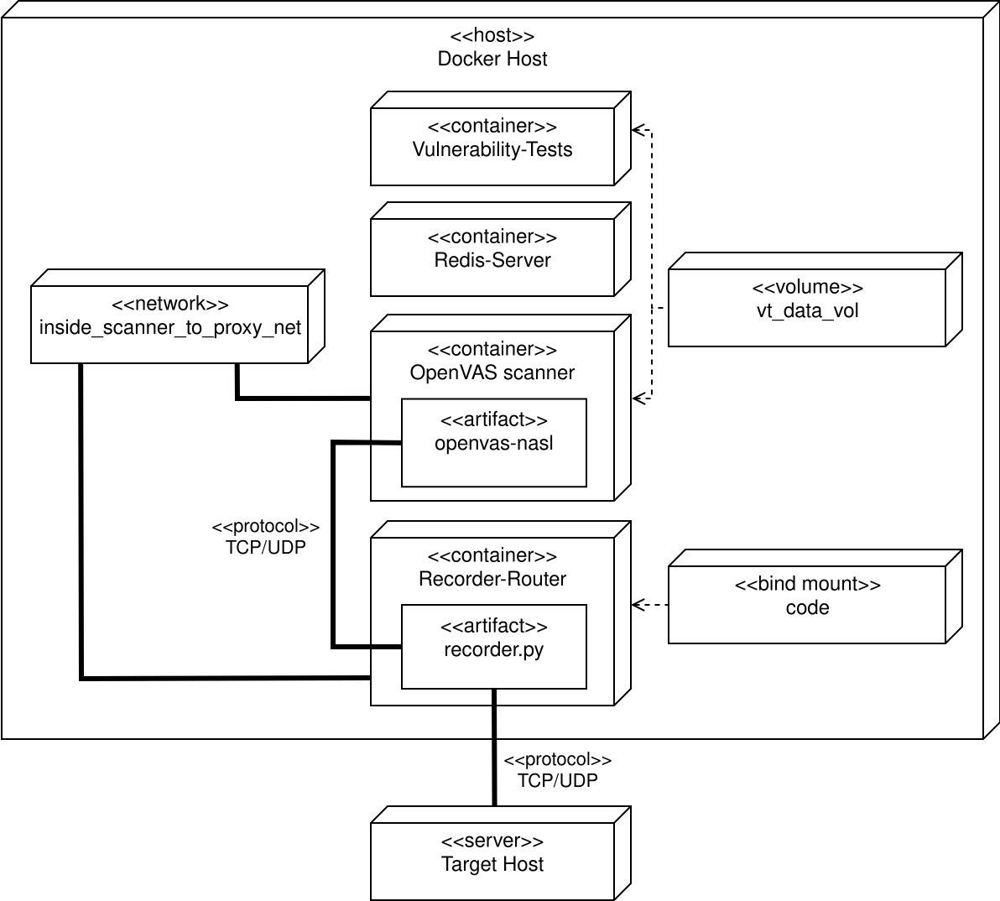

# System Testing Vulnerability Tests

This repository contains all the code submitted as part of my master thesis. The goal was to create a way to test the continued functionality of vulnerability tests (VTs) in OpenVAS for which a change to a core library function might have affected its ability to function in unforeseen ways. This system testing framework would automatically catch those issues and allow developers to narrow down and fix the issue before the change goes unnoticed and reaches all customers. Having a way to test existing VTs without relying on available hosts is crucial since in many cases, especially for older VTs relying on severely outdated software, it might not even be possible to set up a host that can be used as a target for this VT.

Using this testing framework, a developer who was wise enough to create a few test cases for a new VT they were creating will have made it possible to test its continued functionality years down the line. The simplified way this works is the following:

1. The VT in question is being run against a target with the IP xyz using OpenVAS.
2. Traffic between the VT and the target host is being intercepted and recorded in something akin to a "man in the middle" attack using clever routing inside a virtual Docker network, the TPROXY functionality of the Linux kernel and a proxy server handling and recording the communication without any party noticing this step.
3. In the case of HTTP, the request and the corresponding response are being saved in a powerful custom file format using JSON, making up a test case. The recorded request tells an emulated target which request to watch for and the response is what the emulated target would reply with. Essentially, this mimics the facade of the actual host that was recorded, storing its behavior in a test case that can be used years later to run the exact same scan against.
4. At a different point in time when this VT should be tested, the target emulator can be used for this test with the test case that has been created before. Differences in the scan report from OpenVAS against this emulated target would indicate that something about this VT has changed since the test case was recorded. Developers can now take action to troubleshoot what the root cause might have been.

This approach can be described as "record-and-replay" as commonly called so in literature. Essentially, the communication between the VT and a real target host is being recorded into a test case and then later replayed when testing the VT with an emulated target host instead. Although just implemented for HTTP as a proof of concept, this approach can be implemented for any protocol. With this testing framework, developers can say with confidence that a 10 year old VT still works as expected, even if it's not possible to find or set up a host for it anymore. The recording step integrates perfectly into the existing workflow for VT developers since they are running VTs against hosts during development anyways.

Here is an overview of how the Docker environment is set up for the purpose of recording the communication of an OpenVAS scan:

